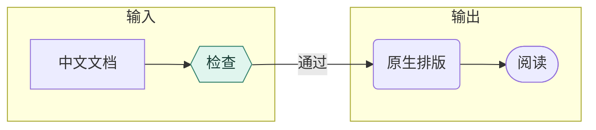
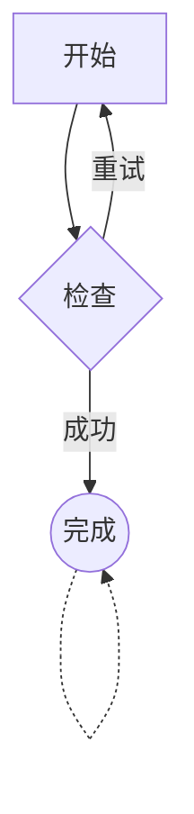
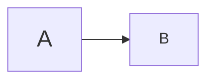

# 流程图：分组、样式与回边

## 单层分组与节点连接

```mermaid
flowchart LR
  subgraph source [输入]
    A[中文文档] --> B{{检查}}
  end
  subgraph output [输出]
    C(原生排版) --> D([阅读])
  end
  B -->|通过| C
  classDef selected fill:#e0f5ee,stroke:#34836e,color:#183d35
  class B selected
```

## 回边与自环

```mermaid
flowchart TD
  A[开始] --> B{检查}
  B -->|重试| A
  B -->|成功| C((完成))
  C -.-> C
```

## 样式不支持时保留源码

```mermaid
flowchart LR
  A --> B
  style A font-size:24px
```
