# Mermaid flowchart compatibility

Native rendering examples.

## TD / rectangle

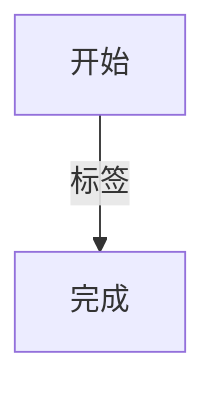

## TD / round

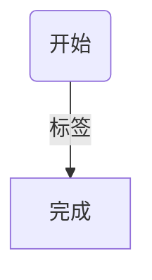

## TD / decision

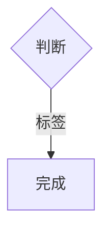

## TD / circle

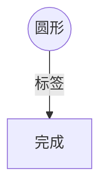

## TD / stadium


## TD / quoted

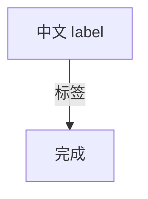

## TB / rectangle


## TB / round


## TB / decision


## TB / circle


## TB / stadium

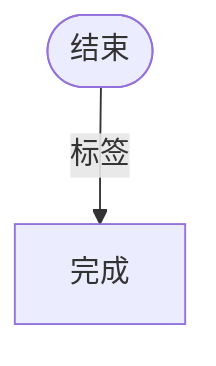

## TB / quoted


## BT / rectangle

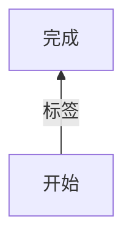

## BT / round

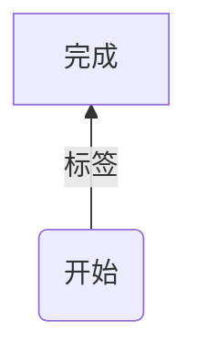

## BT / decision

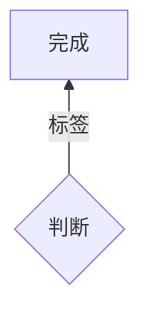

## BT / circle

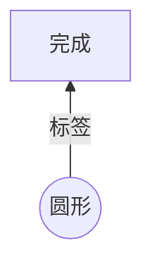

## BT / stadium

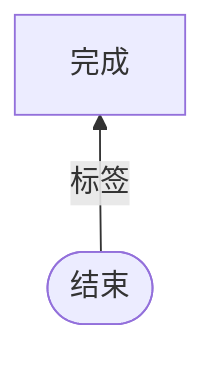

## BT / quoted

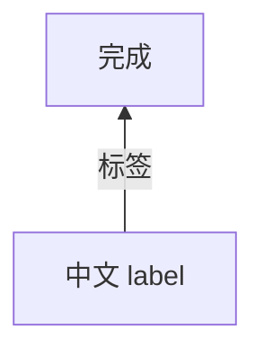

## LR / rectangle


## LR / round

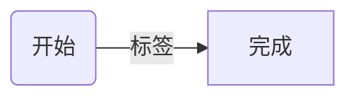

## LR / decision

```mermaid
flowchart LR
A{判断} -->|标签| B[完成]
```

## LR / circle

```mermaid
flowchart LR
A((圆形)) -->|标签| B[完成]
```

## LR / stadium

```mermaid
flowchart LR
A([结束]) -->|标签| B[完成]
```

## LR / quoted

```mermaid
flowchart LR
A["中文 label"] -->|标签| B[完成]
```

## RL / rectangle

```mermaid
flowchart RL
A[开始] -->|标签| B[完成]
```

## RL / round

```mermaid
flowchart RL
A(开始) -->|标签| B[完成]
```

## RL / decision

```mermaid
flowchart RL
A{判断} -->|标签| B[完成]
```

## RL / circle

```mermaid
flowchart RL
A((圆形)) -->|标签| B[完成]
```

## RL / stadium

```mermaid
flowchart RL
A([结束]) -->|标签| B[完成]
```

## RL / quoted

```mermaid
flowchart RL
A["中文 label"] -->|标签| B[完成]
```

## Cycle

```mermaid
graph TD
A[开始] --> B{判断}
B -->|继续| A
B -->|结束| C[结束]
```

## Unsupported syntax

```mermaid
flowchart TD
A@{ shape: rounded } --> B
```
