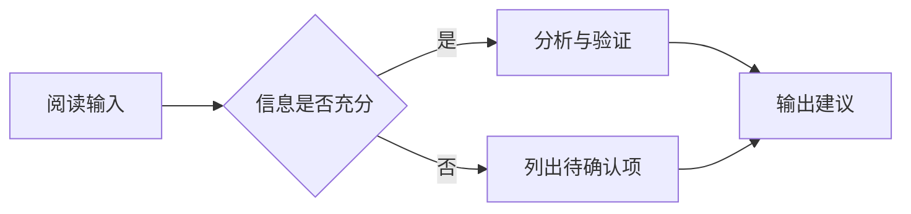

# 任务

请审阅以下方案，并给出可执行的改进建议。

## 要求

- 先给出结论，再说明依据。
- 列出需要验证的假设。
- 保留原始约束，不虚构测量数据。

## 处理流程

```mermaid
flowchart LR
  A[阅读输入] --> B{信息是否充分}
  B -->|是| C[分析与验证]
  B -->|否| D[列出待确认项]
  C --> E[输出建议]
  D --> E
```

## 输出格式

1. 结论
2. 主要问题
3. 建议步骤
4. 验证方式
